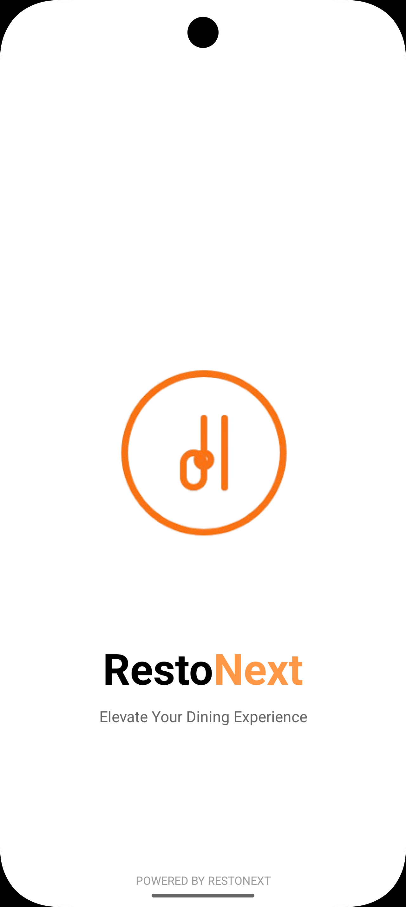
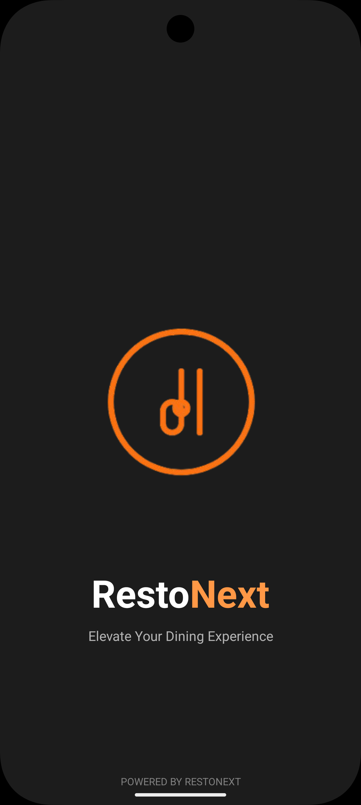

# RestoNext

**Elevate Your Dining Experience**

RestoNext is a modern React Native mobile application that helps users discover nearby restaurants with an intuitive map-based interface. Find the perfect dining spot, explore restaurant details, and navigate seamlessly to your chosen destination.

## Features

- **Interactive Map View**: Browse restaurants on an interactive map interface with custom markers (Apple Maps on iOS, default map on Android)
- **Location-Based Search**: Automatically discover restaurants within 5km of your current location
- **Mock Restaurant Data**: Uses sample restaurant data for demonstration purposes
- **Restaurant Details**: View comprehensive information including:
  - Restaurant name, type, and cuisine
  - Distance from your current location
  - Contact information and operating hours
  - Restaurant images and ratings
- **Smart Search**: Search restaurants by name with real-time filtering
- **Turn-by-Turn Navigation**: Get directions to any restaurant with a single tap
- **Theme Support**: Beautiful light and dark mode support
- **Custom Splash Screen**: Branded splash screen with 30-second auto-transition

## 📹 Demo Video

Watch the app in action:

- [View Screen Recording - Dark Mode](https://drive.google.com/file/d/1oKFOS5nKWdDXTLTsxtV8gi_W9_VSruwO/view?usp=sharing)
- [View Screen Recording - Light Mode](https://drive.google.com/file/d/1ZNpTEkORDE_HfZmdYlp8sg3FgPuDZ2QU/view?usp=drive_link)

## Screenshots

<table>
  <tr>
   <td></td>
    <td></td>
    <td></td>
  </tr>
  <tr>
    <td align="center"><em>Splash Screen</em></td>
    <td align="center"><em>Restaurant Home Screen Dark Mode</em></td>
    <td align="center"><em>Restaurant Home Screen Light Mode</em></td>
  </tr>
  <tr>
    <td></td>
    <td></td>
    <td></td>
  </tr>
  <tr>
    <td align="center"><em>Detail View</em></td>
    <td align="center"><em>Splash Screen Dark Mode</em></td>
    <td align="center"><em>Selected Location Selection</em></td>
  </tr>
  <tr>
    <td></td>
    <td></td>
    <td></td>
  </tr>
  <tr>
    <td align="center"><em>Slected Location Detail View</em></td>
    <td align="center"><em>Selected Location Selection Dark Mode</em></td>
    <td></td>
  </tr>
</table>

> **Note**: The demo video (`Simulator Screen Recording - iPhone 16 Pro - 2026-02-15 at 12.51.00.mp4`) is available in the `screen_shots` folder but is too large (111 MB) to include in the repository. You can view it locally or upload it to YouTube/Vimeo for sharing.

## Tech Stack

- **React Native 0.84.0** (New Architecture)
- **TypeScript**
- **React Navigation** - Navigation framework
- **React Native Maps** - Native map integration (Apple Maps on iOS, default on Android)
- **FontAwesome6** - Icon library
- **Redux Toolkit** - State management
- **Inter Font Family** - Custom typography
- **Gradle 9.0.0** - Android build system

## Prerequisites

Before you begin, ensure you have the following installed:

- **Node.js** (v18 or higher)
- **npm** or **Yarn**
- **React Native development environment** - Follow the [React Native Environment Setup](https://reactnative.dev/docs/set-up-your-environment) guide
- **Android Studio** (for Android development)
- **Xcode** (for iOS development - macOS only)
- **CocoaPods** (for iOS dependencies)

## Setup Instructions

### 1. Clone the Repository

```bash
git clone <repository-url>
cd RestoNext
```

### 2. Install Dependencies

```bash
# Using npm
npm install

# OR using Yarn
yarn install
```

### 3. Link Custom Fonts

The app uses the Inter font family. Link the fonts to your project:

```bash
npx react-native-asset
```

This will copy the fonts from `src/assets/fonts/` to the native iOS and Android projects.

### 4. iOS Setup (macOS only)

Install Ruby dependencies and CocoaPods:

```bash
# Install bundler dependencies
bundle install

# Install CocoaPods dependencies
cd ios
bundle exec pod install
cd ..
```

### 5. Android Setup

For Android builds, ensure the `NODE_BINARY` environment variable is set:

```bash
export NODE_BINARY=/usr/local/bin/node
```

You may want to add this to your `~/.zshrc` or `~/.bashrc` file.

## Note About Data and Maps

**Mock Data**: The app currently uses mock/sample restaurant data for demonstration purposes. To integrate with real restaurant data, you would need to connect to a backend API or use a service like Google Places API.

**Map Provider**: The app uses the default map provider:

- **iOS**: Apple Maps (native iOS maps)
- **Android**: Default system maps

If you want to use Google Maps on both platforms, you would need to:

1. Obtain a Google Maps API key from [Google Cloud Console](https://console.cloud.google.com/)
2. Uncomment `PROVIDER_GOOGLE` import in `src/core/util/constant/constant.ts`
3. Change `MAP_PROVIDER = PROVIDER_DEFAULT` to `MAP_PROVIDER = PROVIDER_GOOGLE`
4. Add your API key to `GOOGLE_MAPS_API_KEY` constant
5. Configure the API key in native files:
   - Android: `android/app/src/main/AndroidManifest.xml`
   - iOS: `ios/RestoNext/AppDelegate.swift`

## 🏃 Running the App

### Start Metro Bundler

First, start the Metro development server:

```bash
# Using npm
npm start

# OR using Yarn
yarn start
```

### Run on Android

In a new terminal window:

```bash
# Using npm
npm run android

# OR using Yarn
yarn android

# OR with explicit NODE_BINARY
export NODE_BINARY=/usr/local/bin/node && npx react-native run-android
```

### Run on iOS

In a new terminal window:

```bash
# Using npm
npm run ios

# OR using Yarn
yarn ios
```

## 🛠️ Development

### Project Structure

```
RestoNext/
├── android/                 # Android native code
├── ios/                     # iOS native code
├── src/
│   ├── assets/             # Images, fonts, and icons
│   ├── component/          # Reusable UI components
│   │   ├── atom/          # Atomic components
│   │   ├── molecule/      # Molecular components
│   │   └── organism/      # Organism components
│   ├── core/              # Core utilities
│   │   ├── middleware/    # Redux middleware
│   │   ├── models/        # Data models
│   │   ├── modules/       # Feature modules
│   │   └── util/          # Utility functions
│   └── module/            # Feature modules
│       └── common/        # Common screens
└── __tests__/             # Test files
```

### Hot Reload

- **Android**: Press <kbd>R</kbd> twice or <kbd>Ctrl</kbd>+<kbd>M</kbd> (Windows/Linux) / <kbd>Cmd</kbd>+<kbd>M</kbd> (macOS) to open Dev Menu
- **iOS**: Press <kbd>R</kbd> in iOS Simulator

### Custom Fonts

The app uses the **Inter font family** with various weights and styles. Fonts are located in `src/assets/fonts/` and are automatically linked to both platforms.

**Available fonts:**

- Inter (18pt, 24pt, 28pt)
- Weights: Thin, ExtraLight, Light, Regular, Medium, SemiBold, Bold, ExtraBold, Black
- All weights available in regular and italic styles

**Usage example:**

```tsx
import { Text, StyleSheet } from 'react-native';

const styles = StyleSheet.create({
  text: {
    fontFamily: 'Inter_18pt-Regular',
    fontSize: 16,
  },
  heading: {
    fontFamily: 'Inter_24pt-Bold',
    fontSize: 24,
  },
});
```

For detailed font usage instructions, see [src/assets/fonts/README.md](src/assets/fonts/README.md).

**Adding new fonts:**

1. Place font files in `src/assets/fonts/`
2. Run `npx react-native-asset` to link fonts
3. For iOS: `cd ios && bundle exec pod install`
4. Rebuild the app

### Clean Build

If you encounter build issues, try cleaning the build:

```bash
# Android
cd android && ./gradlew clean && cd ..

# iOS
cd ios && rm -rf build Pods && bundle exec pod install && cd ..
```

## Troubleshooting

### Android Build Issues

**Issue**: `npx: command not found` during build

**Solution**: Set the NODE_BINARY environment variable:

```bash
export NODE_BINARY=/usr/local/bin/node
```

**Issue**: Resource linking failed

**Solution**: Clean and rebuild:

```bash
cd android && ./gradlew clean && cd ..
npx react-native run-android
```

### iOS Build Issues

**Issue**: CocoaPods dependencies not found

**Solution**: Reinstall pods:

```bash
cd ios
rm -rf Pods Podfile.lock
bundle exec pod install
cd ..
```

### General Issues

For more troubleshooting help, see the [React Native Troubleshooting](https://reactnative.dev/docs/troubleshooting) page.

---

**POWERED BY RESTONEXT**

## Learn More

To learn more about React Native and related technologies, check out these resources:

- [React Native Website](https://reactnative.dev) - Official React Native documentation
- [React Native Maps](https://github.com/react-native-maps/react-native-maps) - Maps component documentation
- [React Navigation](https://reactnavigation.org/) - Navigation library documentation
- [Redux Toolkit](https://redux-toolkit.js.org/) - State management documentation
- [Google Maps Platform](https://developers.google.com/maps) - Google Maps API documentation
